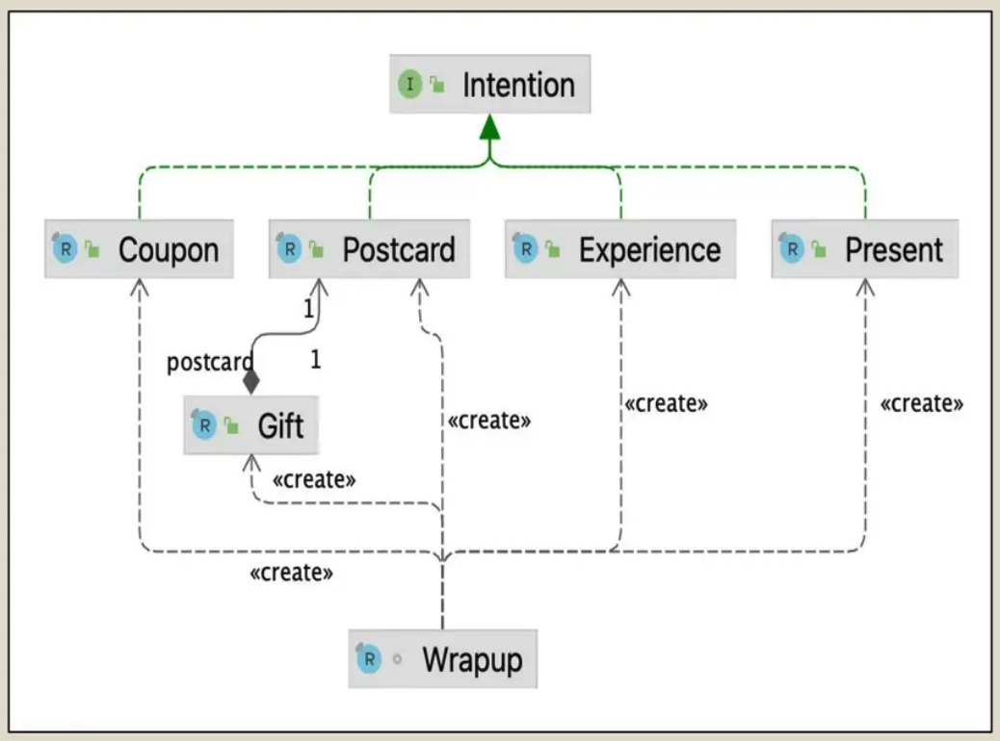

# Learnings from this project

## Requirements
:partying_face: A sender can do a nice gesture and offer a gift.  
:tada: A sender can give a different postcard or surprise depending on celebration.  
:gift_heart: A gift can be a postcard or add to it one of: an online coupon, an experience or a material present.  
:love_letter: A postcard does not have an associated cost, all the other 3 types of gifts have a price.  
:calendar: An online coupon has an expiry date.  
:gift: A present can be placed inside a box.  
:coffee: A sender can never give 2 postcards as a gift. The system will pick the first postcard and ship it.

## Important points
* Links: Talk on [YouTube](https://www.youtube.com/watch?v=LhuYkvMy-CE) and [slideshare](https://www.slideshare.net/slideshow/java-21-language-features-and-beyond/266239643)
* Check _**shell**_ keyword usage in [README.md](README.md) on how to run the application and call various http service calls
* Check how main class [Wrapup](./src/main/java/org/ammbra/advent/Wrapup.java) is set up
  * Note: Wrapup is a record class
  * The **_server setup_** in main class
  * calls [RequestConverter](./src/main/java/org/ammbra/advent/request/RequestConverter.java), which has 2 methods; one processes the request and other prepares JSONObject using _**switch pattern matching**_
* Expressive data modelling using [Records and Sealed interface](./src/main/java/org/ammbra/advent/surprise)  
  
* Usage of **_String template_** in [Intention](./src/main/java/org/ammbra/advent/surprise/Intention.java) sealed class and other record classes